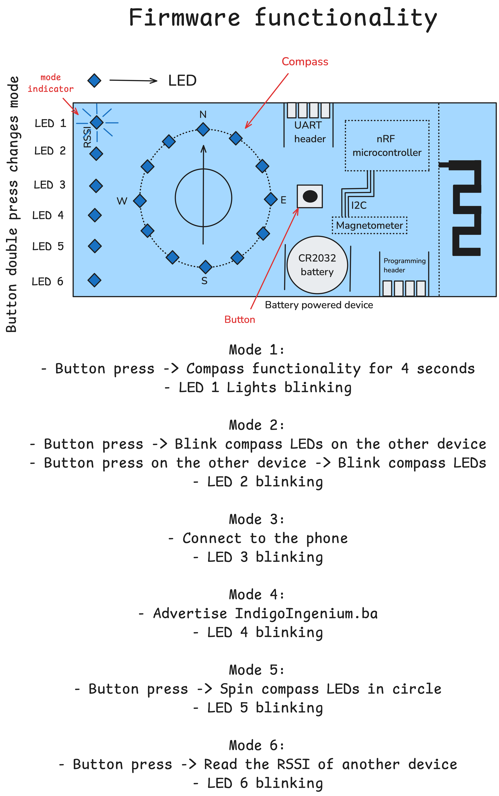

# Bluetooth Compass Project

This project is a personal showcase of my skills in **PCB design, embedded firmware development, and Android application programming**—centered around a custom-built **Bluetooth-enabled digital compass**.

I created this project as a demonstration of my capability to design and manufacture a clean, self-contained PCB solution, free from the reliance on off-the-shelf BLE modules. It’s a manifestation of my passion for building systems from scratch, with a focus on RF design and embedded software.

---

## 🛠️ Hardware Overview

- **Microcontroller**: Nordic nRF52832 with integrated BLE support  
- **Antenna**: Custom-designed **meandering line antenna** tuned to **2.4 GHz**  
- **Magnetometer**: QMC5883L for 3-axis magnetic field sensing (I2C communication)  
- **LEDs**:  
  - 12x Blue LEDs in a circular layout to represent compass directions  
  - 6x Status LEDs: USER, CONNECTIVITY INDICATOR, HEARTBEAT  
- **Battery**: CR2032 coin cell slot  
- **Programming Interface**: SWD (SWCLK, SWDIO), UART connector  
- **Clock**: 32 MHz external crystal for BLE SoftDevice  
- **PCB Stack**: 4-layer custom design, credit-card sized  

> The reset pin is repurposed as a **user input button**. The reset functionality is disabled in software to allow this.

---

## 🔧 Firmware Overview

Firmware is built on **Zephyr RTOS**, enabling modular and modern embedded software design.

A **custom Bluetooth service**, `CompassService`, is implemented, exposing three key characteristics:

1. **Button State**  
2. **User LED Control**  
3. **Direction Output**

### 📡 Magnetometer Integration

- QMC5883L communicates over I2C.  
- Each axis (X, Y, Z) is read as a signed 16-bit value:

```c
int16_t value = (MSB << 8) | LSB;
```

- Orientation is calculated using the X and Y components:

```c
float angle_rad = atan2f((float)mag_y, (float)mag_x);
float angle_deg = angle_rad * (180.0f / M_PI);
if (angle_deg < 0) angle_deg += 360.0f;
```

The direction value is then:
- **Broadcast over BLE** using notify characteristics  
- **Rendered via LEDs** in a circular fashion to act as a real-time compass  

The system runs on the **internal RC oscillator**, while the **external crystal is reserved for BLE operations**.

---

## 📱 Android App Overview

Developed using **Android Studio**, the app uses the **Processing library** to render a dynamic compass needle.

- **BLE scanning** locates the `BluetoothCompass`  
- On connection, the app:  
  - Performs **service discovery**  
  - **Subscribes** to the `Direction` characteristic  
  - **Updates** the compass needle UI in real-time  

This part was relatively straightforward and served as a creative outlet for UI/UX.

---

## 🎯 Purpose

This project was built as a **self-test and demonstration** of:

- Designing an RF-friendly PCB with custom Bluetooth antenna  
- Working with the **nRF52 ecosystem** and BLE stack (SoftDevice + Zephyr)  
- Integrating hardware components like magnetometers and CR2032 power  
- Creating a polished **user-facing Android application**

---

## 🧠 Lessons Learned

Building this project wasn't without hiccups—but every mistake taught me something valuable:

1. **Reversed Magnetometer Pins**  
   Costly PCB error discovered only post-manufacturing. Lesson: Triple-check schematic-to-layout connections.

2. **QFN Soldering Difficulties**  
   My aging soldering iron made soldering QFN packages (magnetometer, MCU) unreliable. Eventually outsourced to **JLCPCB assembly** for these parts.

3. **Signed-to-Unsigned Mistake**  
   I accidentally cast signed 16-bit values from the magnetometer to `uint16_t`, causing direction errors—reminding me of the infamous Ariane 5 bug.

4. **Magnetometer Proximity to Battery**  
   The CR2032 placement near the magnetometer introduced magnetic interference. If I were to redo the board, I’d increase their separation.

5. **No Tilt Compensation**  
   Since the magnetometer acts as a compass only when the board is level, tilts skew the readings. A better design would include an **accelerometer** for tilt compensation:

   ```
   heading = atan2(-Y, X)
   pitch = asin(Z / sqrt(X² + Y² + Z²))
   compensated_heading = heading adjusted for pitch/roll
   ```

---

## 🏁 Conclusion

This project embodies my passion for **electronics**, **firmware engineering**, and **RF system design**. Despite having a **Master’s degree in electronics** and professional experience in embedded development, this personal build was a humbling and rewarding journey. Interestingly, the Android app—which I only work on as a hobby—turned out to be the smoothest part of the whole process!

---

## 🤝 Feedback Welcome!

I enjoy building things I can be proud of—and I’m always open to feedback and suggestions.  
If anything in this project sparks your interest or you’d like to collaborate, feel free to reach out.


## Visit Card features
- User button
- Powered with CR2032 battery
- Bluetooth connectivity
- Magnetometer / compass with HMC5883L IC
- Array of1 12 circulary arranged LEDs to be used as compass
- Array of 6 linearly arranged LEDs to be used for custom needs
- Exposed programming pads
- Exposed UART pads

Visit Card has meandering line antenna for bluetooth connectivity.

To reduce cost, component count and layout space, microcontroller uses internal RC oscilator.
Board is designed as a 4 layer board with stackup:
- Top and bottom layer are signal layers
- Power plane and ground plane are the two middle layers


This is how it started:


## Firmware functionalities


## Schematics


## Layout - bottom copper layer


# Rendered images of the board


## Soldered board


# nRF Connect notes

## How to program the board

[nRF52 DK](https://www.nordicsemi.com/Products/Development-hardware/nRF52-DK) can be used to program the visit card. 

nRF Visit Card board has exposed pads that are used for programming.


### Pinout


## Internal oscilator enable

To enable internal oscilator for nRF52832 in the proj.conf file add:
````
CONFIG_CLOCK_CONTROL_NRF_K32SRC_RC=y
CONFIG_CLOCK_CONTROL_NRF_K32SRC_500PPM=y
CONFIG_CLOCK_CONTROL_NRF_K32SRC_RC_CALIBRATION=y
CONFIG_CLOCK_CONTROL_NRF_CALIBRATION_LF_ALWAYS_ON=y
````

## Enable rest pin to be input GPIO

In the overlay file add:

```
&uicr {
	/delete-property/ gpio-as-nreset;
};
```

after it make sure to call:

```
nrfjprog --eraseuicr
nrfjprog --program <path to hex file> --verify
```

 You might need to reset the board after this - unplug it and plug it back in.

## If _printk_ is not working
In the proj.conf file add:
````
CONFIG_CONSOLE=y
````
## Disabling NFC pins
Pins P0.09 and P0.10 are NFC pins and if you wan't to use them as GPIO pins you need to disable NFC.
[nrf52 enabling gpio on nfc pins](https://devzone.nordicsemi.com/f/nordic-q-a/35505/nrf52-enabling-gpio-on-nfc-pins)
```
CONFIG_NFCT_PINS_AS_GPIOS=y
```

## Enable printing via SWD IO and SWD CLK
In the proj.conf file add:
```
CONFIG_LOG=y
CONFIG_UART_CONSOLE=n
CONFIG_RTT_CONSOLE=y
CONFIG_USE_SEGGER_RTT=y
```
then you can use `printf` function.
```
uint16_t a = getAzimuth();
printf("Azimuth: %d\n", a);
```
Make sure to connect to RTT (Real-Time Transfer).


## 

 # Knowledge Library

 [nRF Connect SDK Fundamentals](https://academy.nordicsemi.com/courses/nrf-connect-sdk-fundamentals/)
 
 [Bluetooth Low Energy Fundamentals](https://academy.nordicsemi.com/courses/bluetooth-low-energy-fundamentals/)
